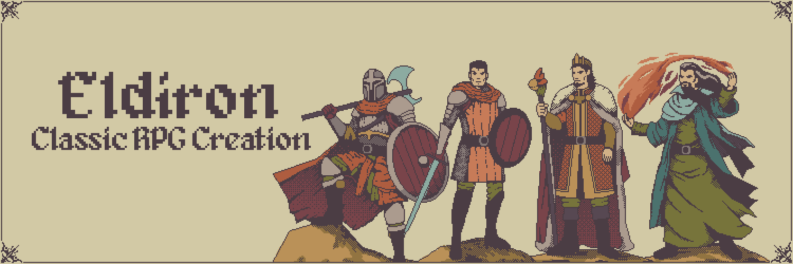
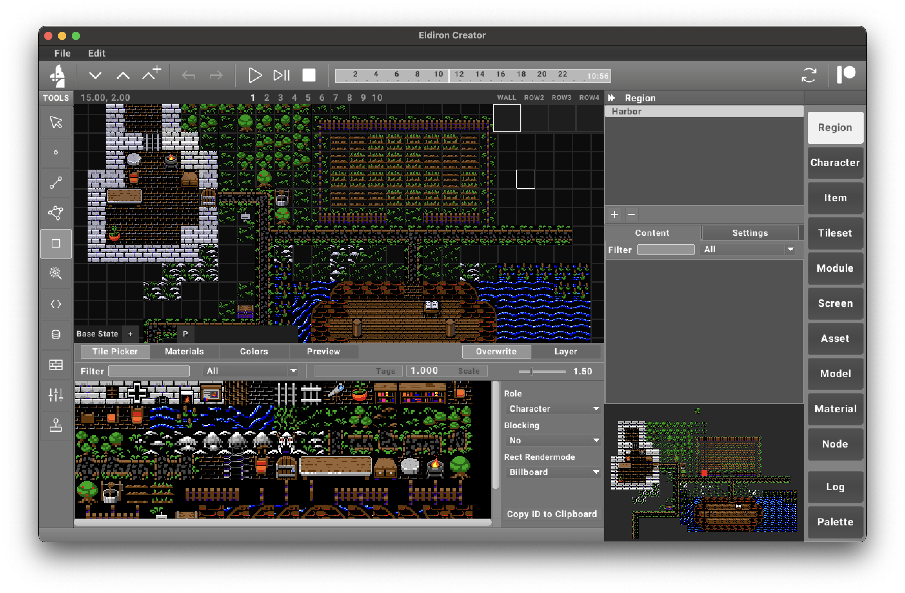
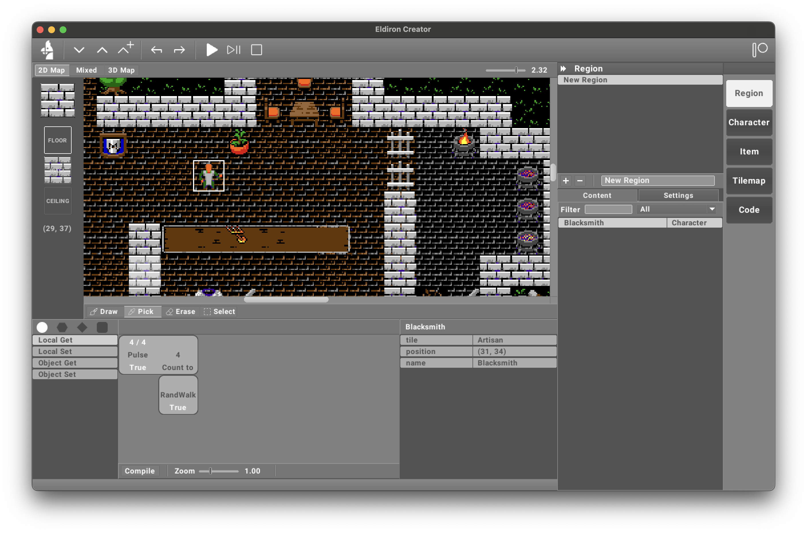

**Eldiron** is a cross-platform creator for classic retro role-playing games (RPGs). Its primary goal is to enable the creation of RPGs reminiscent of the 1980s and 1990s while incorporating modern features such as multiplayer support, procedural content generation, and more.

Eldiron natively supports **2D** (like Ultima 4/5), **isometric**, and **first-person** RPGs, allowing developers to craft a variety of experiences effortlessly.

Eldiron is open-source and licensed under the **MIT License**.

The **first alpha version**, featuring the new **Doom-style editor**, is now available! I’m currently working on documentation and tutorial videos—stay tuned!

2D Example           | 3D First Person Example
:-------------------------:|:-------------------------:
  |  

### Features of v1:

- **Enhanced Doom-style editor** with linedefs and sectors for creating maps. **70% Done**.
  - The editor is also used to create **procedural character/item models and materials**.
  - Includes a **full set of tools** (Selection, Vertex, Linedef, Sector, Rect).
  - Apply effects like **various light sources and particles** to the map.

- **Python-powered scripting system** for creating advanced logic for characters and items. **50% Done**.
  - **Modules** are Python classes that can be used via scripting or within the **node-based visual scripting system**. **0% Done**.

- **Tilesets**: Use your own or the supplied **Eldiron tileset** for your games. **100% Done**.
- **Rendering**: Supports **2D, Isometric, and First-Person** rendering. **100% Done**.

---

If you’d like to support the **Eldiron** project, please consider joining my [Patreon](https://www.patreon.com/eldiron). Your support helps me continue development, commission tilesets, host databases and forums, and more.

---

<!--  -->

<!--  -->

# Sponsors

None yet

<!--  -->
