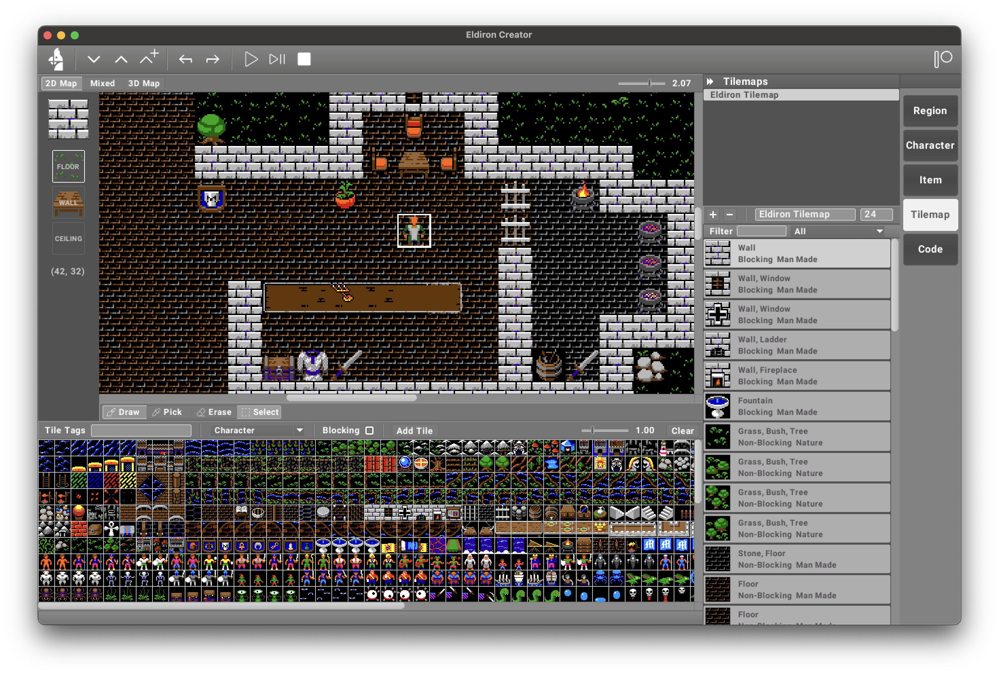

Eldiron is a cross-platform creator for classic, retro role-playing-games (RPGs). It’s main aim is to create games similar to the RPGs of the 80’s and 90’s but with modern features as well as support for single and multi-player experiences, procedural content and much more.

Eldiron is open source and licensed under the MIT.

---

### Rewrite of Eldiron in Progress

I am in the process of rewriting Eldiron, the current release on GitHub still reflects the old code base. The first release for the new code base (v0.85) will be released soon.

The documentation on this site will soon be updated to reflect the new code base as well.

---

<!--  -->

# Sponsors

