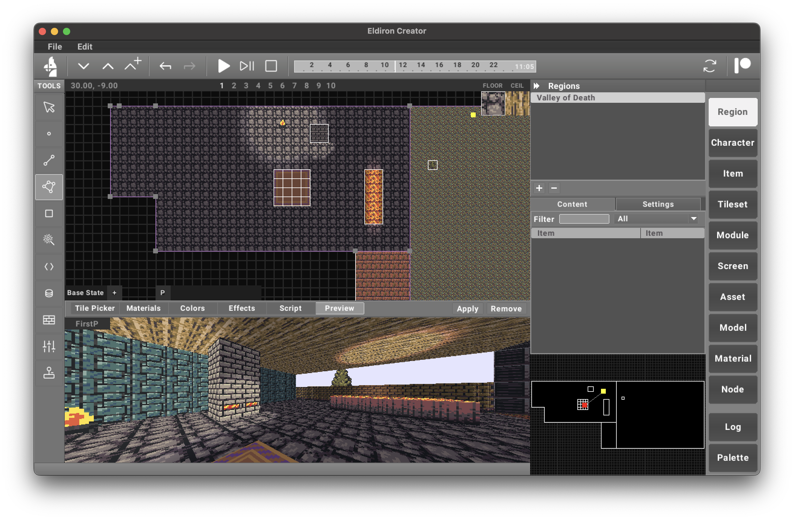

**Eldiron** is a cross-platform creator for classic retro role-playing games (RPGs). Its primary goal is to enable the creation of RPGs reminiscent of the 1980s and 1990s while incorporating modern features such as multiplayer support, procedural content generation, and more.

Eldiron natively supports **2D** (like Ultima 4/5), **isometric**, and **first-person** RPGs, allowing developers to craft a variety of experiences effortlessly.

Eldiron is open-source and licensed under the **MIT License**.

The **first alpha version**, featuring the new **Doom-style editor**, is now available! I’m currently working on documentation and tutorial videos—stay tuned!

2D Example           | 3D First Person Example
:-------------------------:|:-------------------------:
  |  

---



---

### Features of v1

- **Doom-style World Editor** for building levels with linedefs and sectors. **70% Done**
  - Also used to design **procedural characters, items, and materials**
  - Packed with powerful tools: **Selection, Vertex, Linedef, Sector, Rect**
  - Supports **dynamic effects** like light sources and particle systems

- **Python-based scripting system** to power deep game logic. **60% Done**
  - Use Python **modules** directly or plug them into a **visual node editor** (coming soon) **0% Done**

- **Flexible Tileset System** — Use your own tilesets**. **100% Done**
- **Multi-perspective Rendering** — Create games in **2D, Isometric, or First-Person** views. **100% Done**
---

If you’d like to support the **Eldiron** project, please consider joining my [Patreon](https://www.patreon.com/eldiron) or send a [Donation](https://www.paypal.me/markusmoenigos). Your support helps me continue development, commission tilesets, host databases and forums, and more.

---

# Sponsors

None yet

<!--  -->
