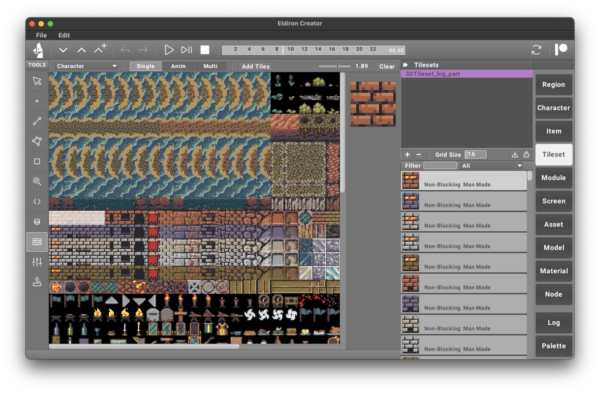

## Region

**Regions** represent **levels or world maps** in your game.

To create a new region, press the **+** button in the **Region** section. Once created, you can immediately start designing your level using map tools such as **Linedef, Sector, and Rect**.

## Character

A **Character** is an entity in your game—either a **player** or a **non-player character (NPC)**.

To create a character, press the **+** button in the **Character** section.

- Character behavior can be scripted using the **Code Tool**.
- Initial attributes can be set with the **Data Tool**.

Refer to the **Scripting & Data** chapter for more details on these tools.

Characters act as **templates**—you can create an instance of a character by **dragging it from the Character section onto the map**.

## Item

An **Item** is an object in your game that can be **picked up** or **interacted with** by entities.

To create an item, press the **+** button in the **Item** section.

- Item behavior can be scripted using the **Code Tool**.
- Properties can be set in the **Data Tool**.

Like characters, **items serve as templates**—dragging them from the Item section onto the map creates an instance.

Items are **highly flexible**. They can be **static** or **interactive** (e.g., lighting a torch, displaying a message, triggering an event).

## Tileset

A **Tileset** is a **PNG file** containing a **grid of tiles** used to create maps.

To add a tileset, press the **+** button in the **Tileset** section—this opens a file browser where you can select a PNG file.

- The **Grid Size** field allows you to set the size of each tile.

The screenshot above shows a tileset with the **Tileset Tool** open.

Using the **Tileset Tool**, you can:
- Add selected tiles as **single images**, **animations**, or **multi-tiles** (composed of multiple tiles).
- Only added tiles can be used as **map elements**.

For more details, see the **Tileset Tool** documentation.
