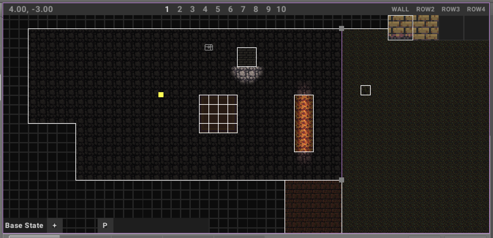

## Overview

This chapter and its sub-sections describe the tools available in **Eldiron Creator**.

## Map Tools Specifics

Some tools are specifically designed for **map editing** and display a common **HUD**. These include:
- **Selection Tool**
- **Linedef Tool**
- **Sector Tool**
- **Rect Tool**

### Terminology

- **Vertices**: Points that define the corners of geometry *(edited via the Vertex Tool)*.
- **Linedefs**: Lines that connect vertices *(edited via the Linedef Tool)*. Used to create **walls, doors, or paths**.
- **Sectors**: Areas enclosed by edges *(edited via the Sector Tool)*. Used to create **floors, ceilings, or other surfaces**.

### Navigation

You can navigate the map using:
- **Trackpad**: Swipe to move around.
- **Arrow keys**: Move the view in any direction.
- **Mini-map**: Click on the mini-map in the **Region** section to jump to a location.
- **Mouse wheel**: Zoom in and out.

### HUD Overview

- The **upper-left corner** of the HUD shows the **current map position**, which is also marked by a **yellow rectangle** on the map.
- The numbers **1, 2, ..., 0** represent **subdivisions** of the map:
  - **1** = Largest subdivision (for broad layouts)
  - **10** = Smallest subdivision (for fine details)
- Larger subdivisions help create **detailed** maps, while smaller subdivisions are useful for **general layouts**.

### Keyboard Shortcuts

When the **map view** has focus, you can use the **number keys (1-0)** on your keyboard to quickly switch between subdivisions, instead of clicking on the HUD.

### Tile Icons

The **icons in the upper-right corner** of the HUD are **tool-specific** and allow you to **assign tiles** to the selected geometry using the **Apply** and **Remove** buttons.
