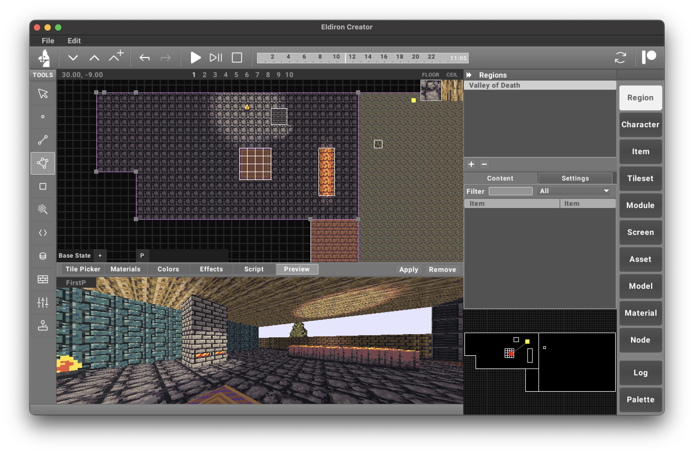

**Eldiron Creator** is where everything comes together—a **graphical editor** that lets you build your own adventures.

On the **left side** of the screen, you’ll find a **list of tools**. These tools are used to **edit the current map** or **modify content** selected from the **right side**, which I call **Sections**.

A **Section** can represent different types of content, such as:
- A **Region** (a level or world map)
- A **Character Model**
- A **Material**
- And more

The tools will always **adapt to the currently selected section**, ensuring a streamlined workflow.

In the following sub-chapters, I will describe the **role of each tool and section** in detail.
