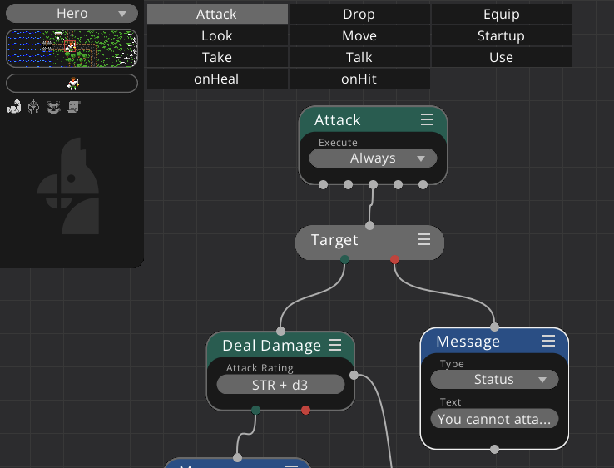

+++
archetype = "chapter"
title = "Graphs & Scripting"
weight = 1
alwaysopen = false
+++

Node graphs in Eldiron are a mix between a behavior node system and scripting. Eldiron tries to combine the best of both worlds. The overall flow of execution is defined via nodes, while parameters of nodes are expressions or scripts which can be as complex as needed.

This has the advantage that you can easily visualize the overall flow of execution in a graph while adding details to behavior via node parameters which do not clutter up the node graph.

In the above screenshot, each tab like *Attack*, *Drop* etc. represents a node graph, each node graph is represented by a *Behavior Tree* node. Node arguments are scripts, like the *Deal Damage* nodes attack rating which is the characters STR value plus a random  number between 1..3.

To understand node graphs better, please read about [behavior trees](./behavior_trees/), [control flow](./control_flow/) and the scripting subsystem.
