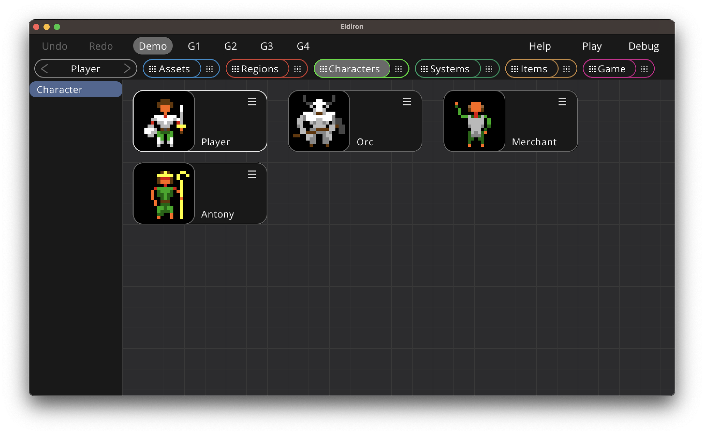
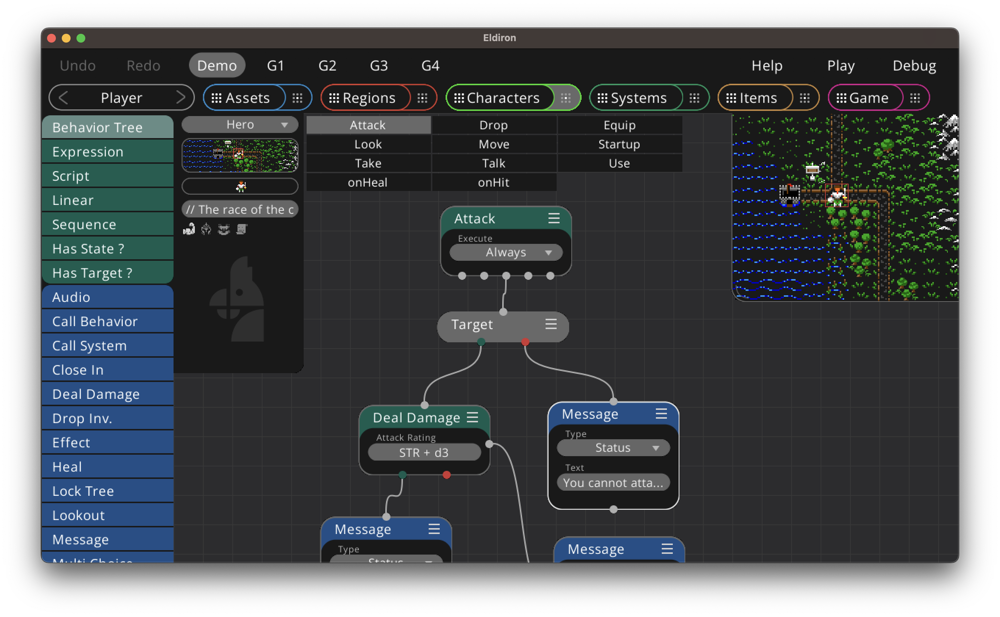

+++
title = "Characters View"
weight = 3
+++

The characters view allows you to define the behavior of characters, both player based characters as well as NPCs. It utilizes [nodegraphs](../../graphs_scripts/) and [behavior trees](../../graphs_scripts/behavior_trees/) to implement character AI. Please read these chapters first.

The *Player* character, which does not implement any AI but defines how input commands are mapped into behavior actions, is always the first character in the overview and cannot be deleted.

To create a new character drag and drop the character item from the left sidebar into the overview. You can rename and delete characters via the nodes context menu. Click on the node thumbnail to open the characters detail view.

## The Player Character

The Player character maps behavior tree names to actions send from [screen scripts](../../../reference/scripting/screen_scripts/). They basically define what behavior tree to execute for every user based action.

For some of these actions there are specific nodes available which handle the given action, like the *Move*, *Take* or *Drop* nodes. These nodes perform the action and return success or false, depending on the outcome.

The screenshot above shows an example for the *Move* command.

For all other actions please use the *Action* node, for example for *Look* or *Use*. The action node searches for a region, item or character with an behavior tree of the same name and execute that tree.

As the actions send from the screen scripts are user defined, you can easily map any action command to the behavior trees / actions of the same name, allowing a very easy and modular way to build up custom character behavior.

#### Special Message Shortcuts

- **${DIRECTION}** is the shortcut for the direction of the user initiated action. In the above screenshot we use it to send back "Move ${Direction}" or "Move ${Direction} - Blocked" messages back to the user.

- **${SUBJECT}** is the subject of the action. For take and drop actions it is the name of the item we take or drop. For example you can send something like this back to the user on success on the take action: "You take: ${SUBJECT}.".

## Non Player Characters

TODO

