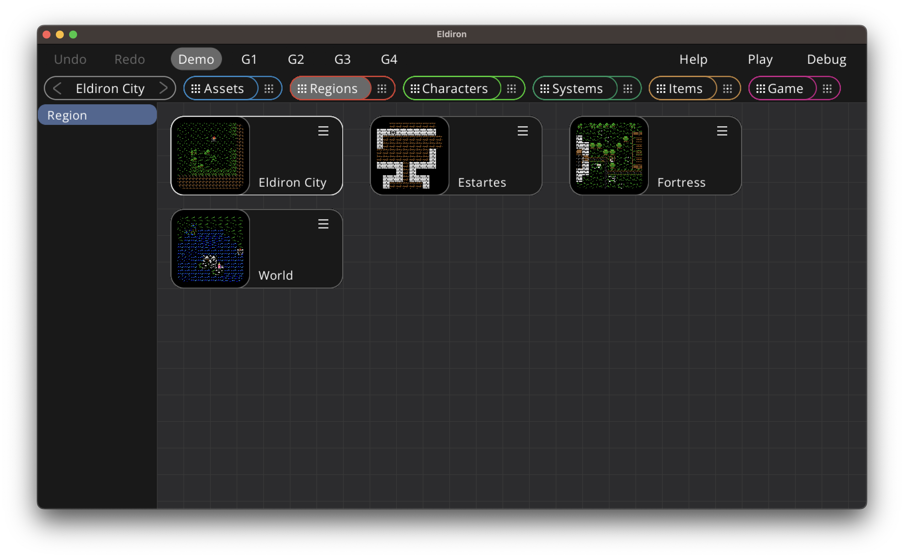
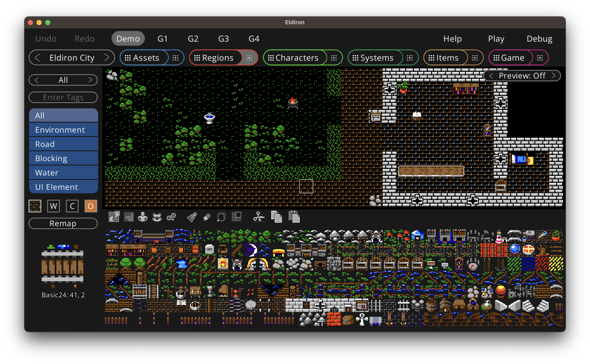
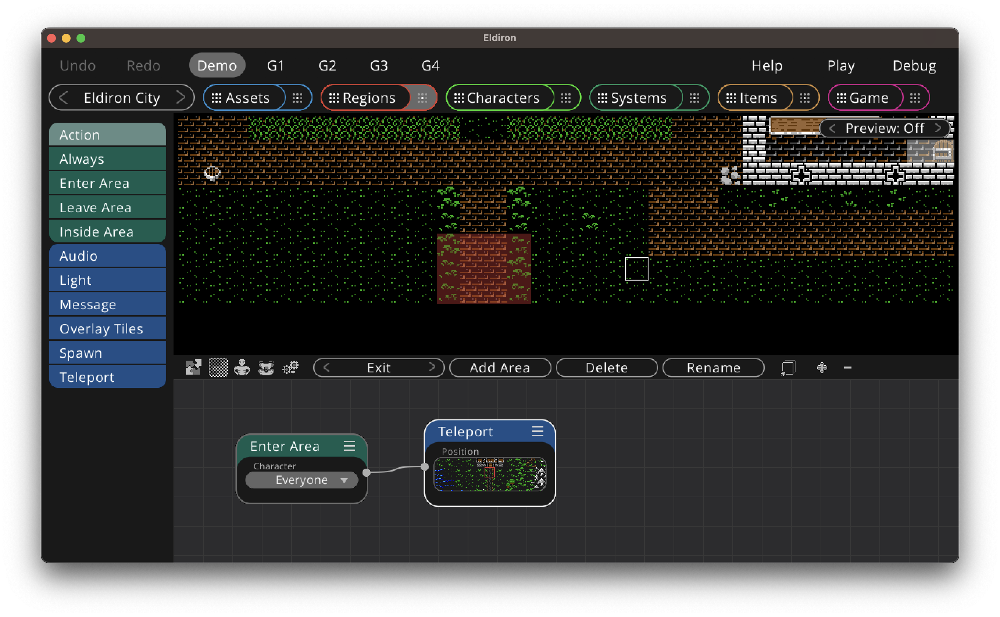
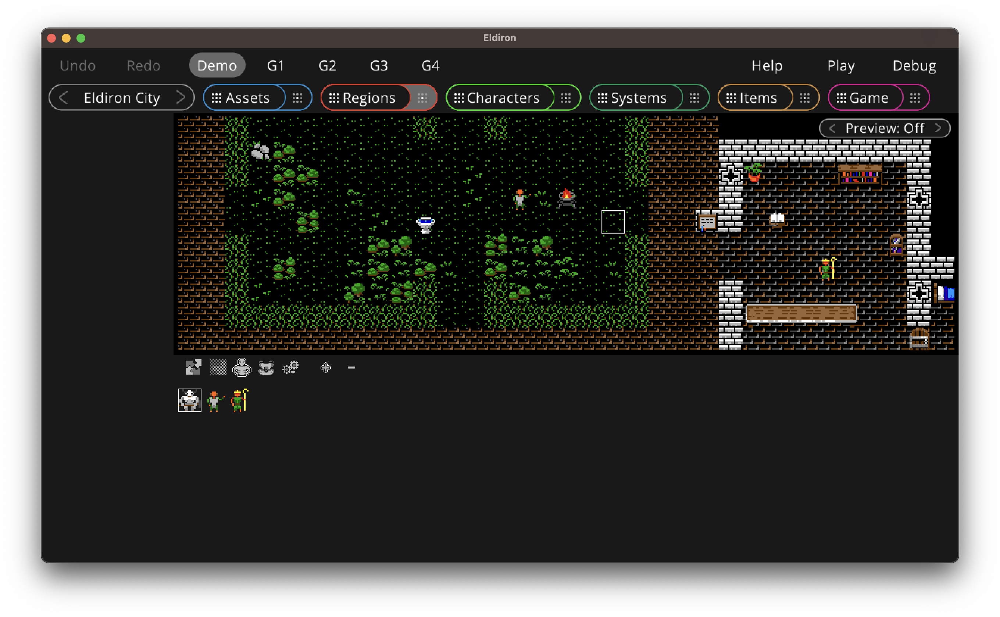
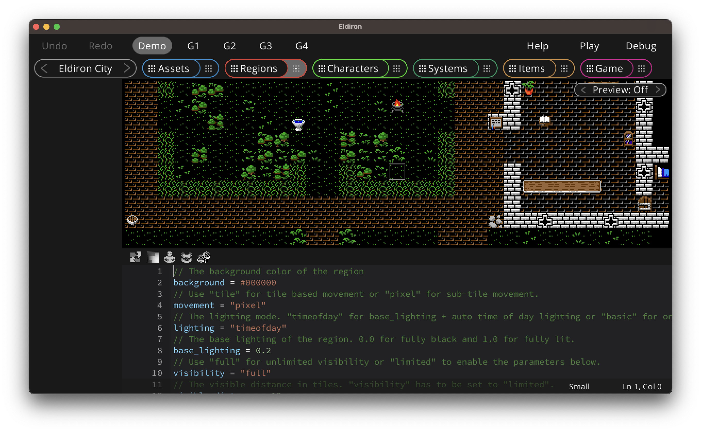

+++
title = "Regions View"
weight = 2
+++

Regions in Eldiron can be towns, dungeons, the world itself, i.e. anywhere the characters can go. You can paint regions with the tiles you defined in the assets view. The behavior of tiles depends on the properties you set for the tiles in the [tile-map details view](../assets_view/).

If you want to create a new region you can simply drag and drop the *Region* item (inside the left list) into the overview. You can rename and delete regions using the context menu of each region node (located in the upper right of each node).

Opening the region details is as simple as clicking the preview thumbnail of the region node you want to edit.

# Region Details View

## Drawing Tiles

Keyboard shortcut: **D**

In the bottom of the view you have the tile selector. The tiles being shown depend on the currently selected valid usage role, which is one of *All*, *Environment*, *Road*, *Blocking*, *Water* and *UI Element*.

You can filter which tiles do show by:

- Cycling throw the tile-maps using the button at the top of the left sidebar (*All* shows the tiles of all tile-maps which is the default).
- Entering a tag, for example *door*, would only show tiles with a *door* tag.

While drawing you can select which layer to draw on, Eldiron supports 4 layers of transparency, with layer one having the lowest transparency level and four the highest.

The **Remap** buttons remaps all tiles in the region. This is necessary because the usage role of the tile is saved in the region itself. If you change the role of a tile in the [assets view](./assets.md), for example from an environment tile to a blocking tile, you need to remap the region to update the role of the tile.

While the the **Clear** button is checked Eldiron clears the clicked tile instead of drawing on it. The **Pick** button selects the tile at the currently clicked location so you can use it for drawing. The cleanr pick buttons of keyboard shortcuts of *C* and *P*.

## Edit Areas

Keyboard shortcut: **E**

Areas are a group of tiles in a region which share common behavior. For example they may teleport the character entering it to a certain location, set a trap, open a door or send a message if you are near a sign. Apart from assigning behavior itself, areas can also be used from character nodes to go to a certain area or walk along a path defined by the area tiles. And lastly they can also modify the visual appearance of a tile, like for example emitting light.

You can cycle through the areas in your region by using the button next to the red *Edit Areas* button. Pressing the *Add Area* button will create an empty new area (that means no tiles are assigned to this area yet). You can *Delete* and *Rename* areas by pressing the respective button.

Clicking on a tile in the region will add the tile to the current area if the *Add Tile* mode is active, if it is set to *Remove* the tile will be removed from the area and if it is set to *Pick* it will select the area the clicked tile belongs to.

## Behavior Nodes

To add behavior to an area just drop nodes from the left sidebar into the graph below the region view. Area nodes work a bit different than other nodes in Eldiron. They do not utilize behavior trees but rather use nodes which query the current occupation state of an area, for example if the player (or another character) just entered or exited the area. These nodes have a green color. You can add multiple green nodes to an area and connect area behavior to them.

## Place Characters

Keyboard shortcut: **C**

When in the character mode, clicking on a tile in the region will create an instance of the currently selected character at the tile. You can select the characters in the character view below the region.

Characters are added if the *+* is selected, if the icon *-* is active the clicked instance of a character is removed.

Missing features for v1.0:

* Name character instances.
* Optionally call a character script function on initialization (to set random character attributes or level).
* Define which character instance is the debug instance which is shown in the character view.

## Place Items

Keyboard shortcut: **I**

Very similar to the character mode, but instead of placing characters item instances are created.

## Settings

Keyboard shortcut: **S**

In the settings you can tune many region specific settings. See the [region settings](../../../reference/settings/region/) reference.

