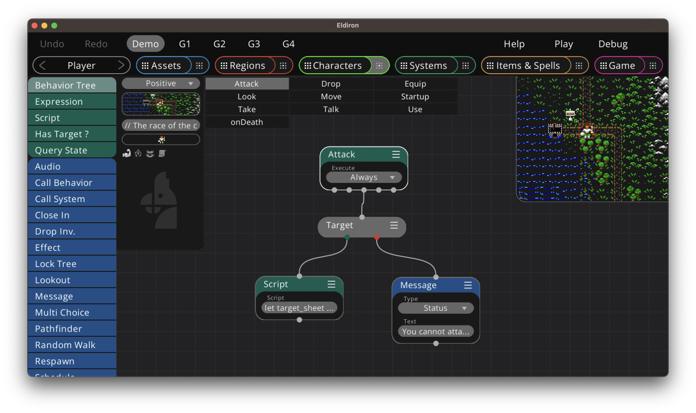

+++
title = "Mechanics"
weight = 2
alwaysopen = false
+++

All game mechanics in Eldiron are either handled via behavior trees or [scripts](../scripting/).

Behavior trees are node graphs which define behavior for a certain activity, like a **Look** or **Attack** functionality for a character.

For player character, the tree to execute are send via an action command from the client. For NPC characters every behavior tree node marked with execute **Always** are executed every game tick.

