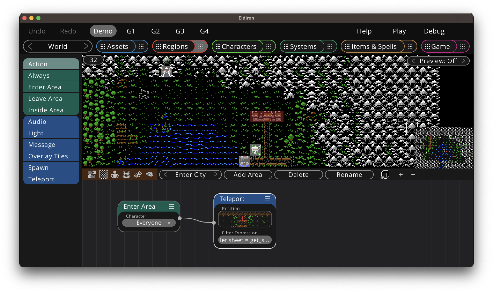

+++
title = "Area Behavior"
weight = 6
alwaysopen = true
+++

Areas are a group of tiles inside a region which share a common behavior, like for example teleporting the player to another region, having interactive tile overlays, providing context for a sign a player can look at and so on.

Area behaviors do not have behavior trees, they are a more simplified in that they only provide interactive behavior with the characters inside (or interacting with) the given region.

The green nodes in the nodelist define the currently available control nodes which define the behavior for the area, the blue nodes provide the available actions.

* [Action](../../nodes/#action). This control node gets executed when the player sends an action to the area, for example he may *Look* at the area and if the action parameter of the node matches the command the nodes on the right will be executed. Use this node to provide any kind of interaction with a region.

* [Always](../../nodes/#always). This node always executes the node chain. I use it for example to always to implement light sources which are always on.

* [Enter Area](../../nodes/#enter-area). This node executes the node chain when somebody enters the area, in the example above for example it teleports the player into the city. You can optionally provide a character filter, in this example we look at the character sheet and only teleport players who have a positive alignment.

* [Leave Area](../../nodes/#enter-area). This node executes the node chain when somebody leaves the area. You may for example automatically close a door.

* [Inside Area](../../nodes/#enter-area). This node executes the node chain when somebody is inside the area. You may for example want to send a message to everybody in the area.

The available actions speak for themselves, you can play audio, provide a light source, teleport the player etc. One action of notice is the [Overlay Tiles](../../nodes/#overlay-tiles) node. This allows you to change tiles in the area on demand. When active only the tiles in the O(verlay) layer get displayed. Use it to reveal secret passages for example.