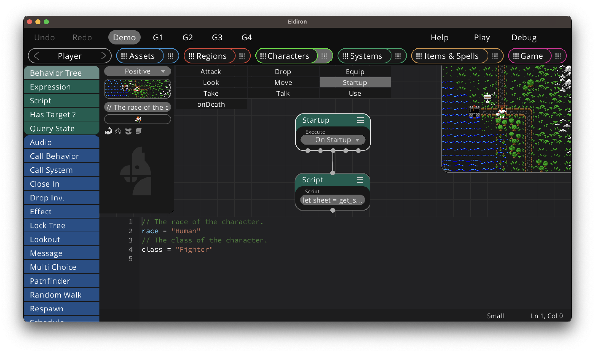

+++
title = "Character Creation"
weight = 3
alwaysopen = true
+++

Every object in the *Characters* view creates a unique in-game character.

When the game starts, it executes all *On Startup* trees on the character, here you can adjust the character sheet, add items to the inventory, assign gold and so on. This is all documented in the [server side scripting chapter](../../scripting/server/).

### Inheritance

When you define a *class* and a *race* for the character in the character settings, like in the screenshot below, also the startup trees for the systems *Fighter* and *Human* class get executed, and they get executed before the character startup trees.

The order of execution is:

Class (Fighter) -> Race (Human) -> Character

This allows that the class implements the main character abilities in the sheet while the *race* implements certain limitations for them (for example a fighter may have a minimum STR value) and the character startup trees themselves can add unique abilities or inventory.

Note that the *class* and *race* behaviors need to be implemented as *Systems* objects. All re-usable behaviors are always located in the *Systems* view.

#### Inheritance for Players

When an action command gets send from the client, Eldiron first tries to execute the behavior tree of the same name in the characters behavior, if it was not found it tries to execute it in the *class* and after that in the *race*.

This allows you to implement behavior inheritance by implementing basic functionality for the *class* and *race* while still having the opportunity to make the character unique by overriding certain trees.

The order of execution is:

Character -> Class -> Race

#### NPC Inheritance

NPCs behave similar to player characters, but instead from commands from the client, Eldiron execute all behavior trees which are marked as *Always*.

Meaning that first all character trees get executed, than the *class* trees and than the *race* trees.

Giving you the same inheritance profile as with player characters.

Players and NPCs can of course inherit from the same classes and races.