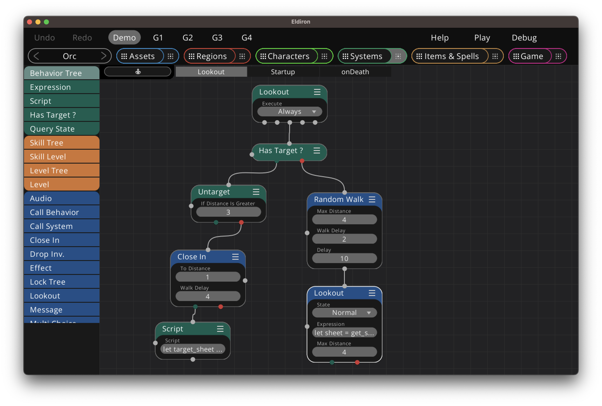

+++
title = "Handling Combat"
weight = 4
alwaysopen = true
+++

Before you can enter combat you need to acquire a target to attack. Targeting works a bit different for player characters (where you attack a certain location) and NPCs. Once you have a target you can calculate damage for both the character and its target by examinig and editing their character sheets. For further information on this, please read [server side scripting](../../scripting/server/) first.

### Targeting

For player characters you use the [Target](../../nodes/#target) node to acquire a target. The target node examines if there is a character within weapon range at the user specified direction. If yes it returns success. Note that the target for player characters is only valid for one round.


For NPCs you will need to use the [Lookout](../../nodes/#lookout) node. This is a very powerful node which allows you to examine sheets of all characters within a given distance and determine if you want to target that character or not. You can than use the [Close In](../../nodes/#close-in) node to close the distance to the target and attack.

You can untarget the target of an NPC with the [Untarget](../../nodes/#untarget) node.

An example could look like this (taken from the Orc System in the Demo):



Remember that for NPCs all behavior trees marked with *Always* will be executed for every tick. So the *Lookout* tree in this example will always run (if we have no locked trees) as long as the character is alive. It fullfills both a random walk and combat, all at once.

First we check if we have a current target with the [Has Target ?](../../nodes/#has-target-) node. If we do not have a target we perform a [Random Walk](../../nodes/#random-walk). Than we check if there is a character with a positive alignment within a distance of 4 tiles, if yes the [Lookout](../../nodes/#lookout) will target this character.

In the next tick we check if we have a target again, and if we have a target check if the target is within 3 tiles, if not we [Untarget](../../nodes/#untarget) that character (the target character fled). If the untarget node failed, and we still have a target, we attack the character we [Close In](../../nodes/#close-in) to the target character until we are within melee range (one tile). Note that we could also have checked the weapon distance here but as the Orc only has melee weapons we hardcoded the distance to 1. [Close In](../../nodes/#close-in) will also handle the job of pursuing the target.

Once we are in melee range [Close In](../../nodes/#close-in) succeeds and we use a script to finally do some damage.

### Dealing Damage

The Orc has a very simple script to deal damage, it throws a d3 dice and subtracts the result from the targets hit points. If the hit points are 0 we call the "onDeath" behavior tree on the target.

```rust
let target_sheet = get_target_sheet();

let damage = d3;
target_sheet.hit_points -= damage;

if damage > 0 {
  send_status_message_target("The orc hits you for " + damage + " damage.");
}

if target_sheet.hit_points == 0 {
  execute_on_target("onDeath");
}

set_target_sheet(target_sheet);
```

There are more sophisticated ways of dealing damage by getting the weapon damage of the current weapon skill level and handling AC for reducing armor. It is your choice if you want NPCs to be full featured, i.e. using full featured skill sets like player or if you want to use easy combat scripts for NPCs like above.

For example a character combat script could look like this:

```rust
let target_sheet = get_target_sheet();
let sheet = get_sheet();

let damage = roll_weapon_damage(sheet, "main hand");
target_sheet.hit_points -= damage;
send_status_message("You hit " + target_sheet.get_name_def() + " for " + damage + " damage.");

if damage > 0 {
  sheet = increase_weapon_skill_by(sheet, "main hand", 1);
  execute_weapon_effects();
}

if target_sheet.hit_points == 0 {
  send_status_message("You kill the " + target_sheet.name + ".");
  sheet = increase_experience_by(sheet, 1);
  execute_on_target("onDeath");
}

set_sheet(sheet);
set_target_sheet(target_sheet);
```

Here we roll the weapon damage for the current skill level, get the hit points, if we deal damage we increase the weapon skill and play the weapon effects (tile fx or audio etc).

Please see the [server side scripting](../../scripting/server/) chapter for a full reference of all the possibilities that you have.