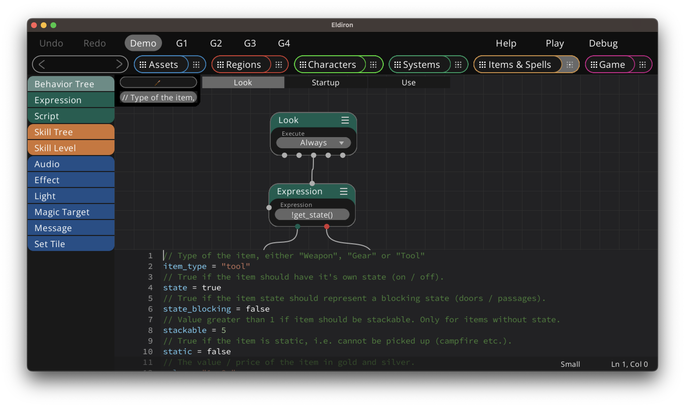
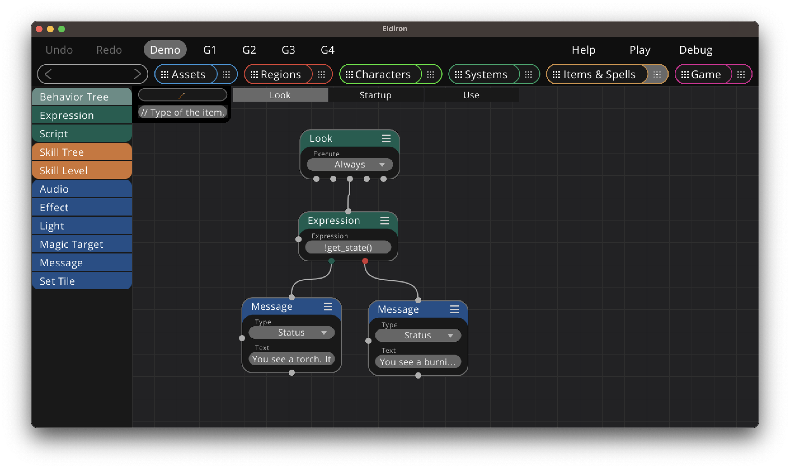
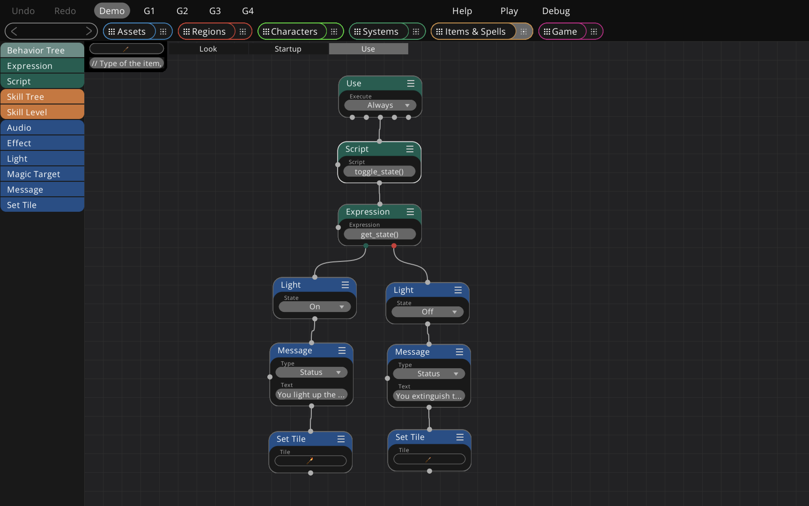
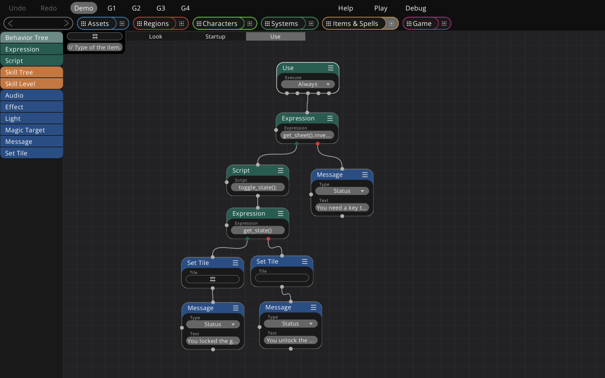

+++
title = "Item States"
weight = 7
alwaysopen = true
+++

In the item settings you can enable state support for an item, like here for a torch. Item states allow you to provide on / off states which can provide states for your light or the locked state of your gate.



Once enabled you have these script functions you can use in the behavior trees of your item:

```rust
// Get the current state
let state = get_state();

// Set the state to a boolean value, here true
set_state(true);

// Toggle the state
toggle_state();
```

#### Using State

In the simplest case, you can provide a message to the user depending on the state of the item. Like here we have a *Look* tree for the item which gets executed if somebody looks at the torch.

We query the current state and either send a message that the torch is currently burning or that it can be ignited upon use.



---

In the *Use* tree of the item we toggle the current state, than, if on we set enable the light state, change the tile of the item and provide feedback to the user.



---

In a slightly more complex example we unlock and open a gate if the user has the right key.

First we check if the user has the right key, using the script expression ```get_sheet().inventory.has_item("Key")``` which checks if the inventory has an item called *Key*.

If yes we toggle the state and if it is enabled set the tile and send a message.

{}
Note that the item tile also defines if the tile blocks a player or not. We set an empty tile if the gate is open. This makes it non-blocking. The blocking state of each tile is the role you assigned to the tile in the tileset details view.
{}



